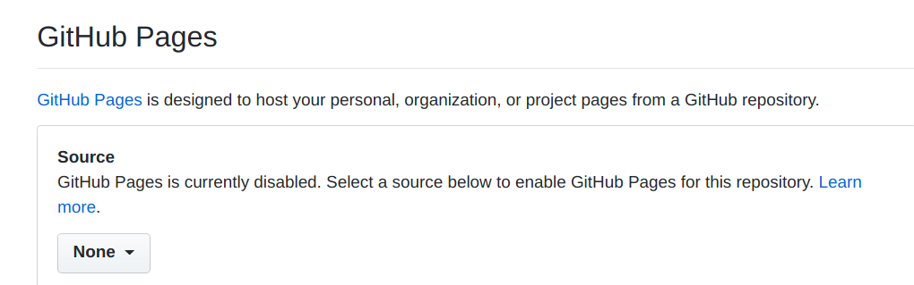
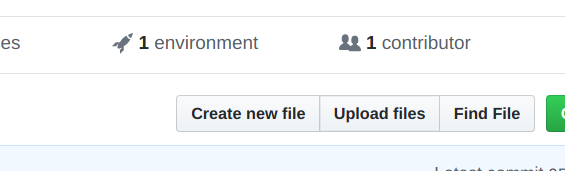
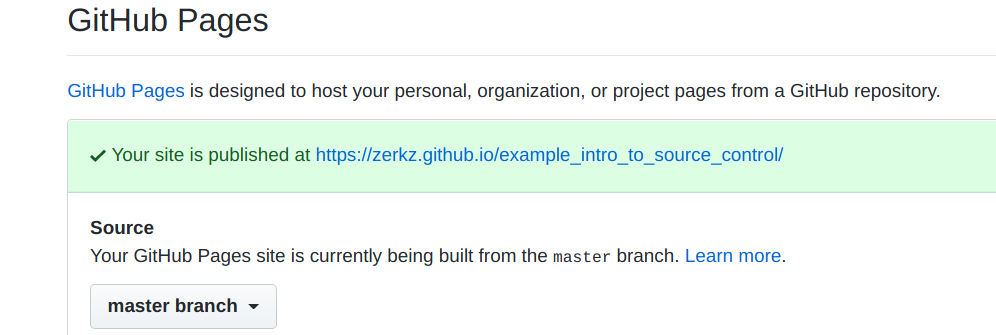

# Intro to Source Control
This repository guide on how to teach an intro to source control, **meant for the high school level**, using Github, Github Pages, and basic HTML.

This is useful if you, as an educator, want to introduce the concept of source control in an exciting way to your students. 

## Goals

* Teach basic source control concepts using `git`, particularly on Github. These concepts include
  * Commits
  * Branches
  * Merge Conflicts
  * Pull Requests
* Only require about 2-3 hours of class time.
* Be interesting, to maintain attentiveness.
* Be as safe as needed.

## Solutions
To keep it interesting, but accessible, this plan focuses on HTML/JS and usage of Github Pages. This is interesting to most students at the high school level, because most classes tend to focus upon Java, Python, and low level algorithms. This class is meant to entice students via producing a real-world, online, sharable creation.

[This repository itself uses Github Pages!](https://zerkz.github.io/intro_to_source_control_classplan/)

# Requirements 

* **All students mblust be 13 or older.** This is because to make an account on Github, you must be 13 or older. 
* Students do not need to really "know" HTML, but **having previous programming experience is needed.** There's no point in introducing source control to someone who hasn't programmed a bit in my humble opinion.
* **You should understand the basics of `git`.** If you do not, take a look at the following resources: 
    * [Github - Hello World Tutorial](https://guides.github.com/activities/hello-world/)
    * [Github Desktop Documentation](https://help.github.com/en/desktop)
    * [Github Basic Command Line Tutorial](https://medium.freecodecamp.org/what-is-git-and-how-to-use-it-c341b049ae61)
    * [Git Basics (Lower level explanation)](https://git-scm.com/book/en/v1/Getting-Started-Git-Basics)
* **You should know basic HTML.**

## Disclaimer

Following this guide will lead you to allowing your students to publish a website publically on the internet in which they will have control over the content. It's important that you follow whatever legal/school policy, if it may apply. 

If this is a concern of yours, worry not, because Github does offer the ability to "protect" the master branch. This will enforce students to run changes by you (via pull requests) before they may be deployed publicly. 

Be sure to explain to your class that they should not put information they do not want public on the repository/website.

# Part 1: Setup

1. Sign up for a [Github account](https://github.com/join) if you do not already have one. 
2. [Create a new repository](https://github.com/new) for the class. If you want to want [changes to reviewed by you before they are deployed](#Locking Down Changes), make it public (protected branches require a paid plan for private repositories). 
3. Enable Github Pages in the repository settings by setting the "source" to master.


5. Create a new file called `index.html` in your repository.

6. Use the HTML below as starter content for the file. You may replace `Hello World!` with a different message if you like. This file will be the entry point/home page of your Github Pages website.

```
<!DOCTYPE html>
<html>
<head>
<meta charset="UTF-8">
<title>Hello World!</title>
</head>

<body>
Hello World!
</body>

</html>
```
7. Go to the URL for your website. You can find tihs URL back on the settings tab of the Repository.

8. You should see the content of `index.html`! 

# Part 2: Onboarding Students
//TODO